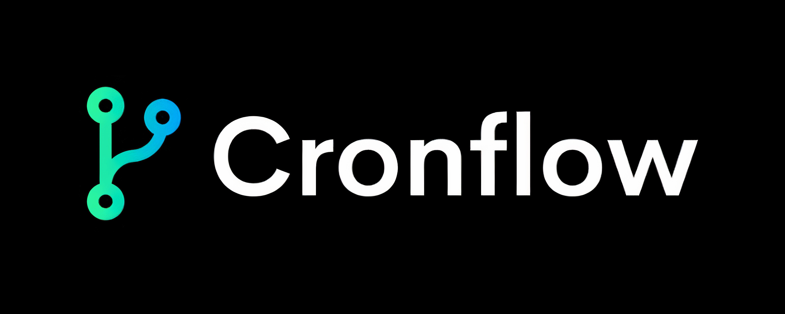

# 🚀 Cronflow

<div align="center">



**The Fastest Code-First Workflow Automation Engine**

[](https://www.npmjs.com/package/cronflow)
[](https://github.com/dali-benothmen/cronflow)
[](http://www.apache.org/licenses/LICENSE-2.0)
[](https://www.typescriptlang.org/)
[](https://www.rust-lang.org/)
[](https://bun.sh/)

_Built with Rust + Bun for unparalleled performance_

</div>

---

## Overview

Cronflow is a powerful workflow automation library designed for developers who need the flexibility of code with exceptional performance. Built with a Rust core and Bun runtime, it delivers sub-millisecond execution speeds while maintaining a minimal memory footprint.

### Key Features

- **🚀 High Performance** - Rust-powered execution engine with sub-millisecond step execution
- **📝 TypeScript Native** - Full type safety and IntelliSense support
- **🔗 Code-First** - Write workflows as code with version control and testing
- **⚡ Real-Time Webhooks** - Built-in HTTP endpoints with schema validation
- **🔄 Event-Driven** - Custom event triggers and listeners
- **🌊 Parallel Execution** - Run multiple operations concurrently
- **✋ Human-in-the-Loop** - Pause workflows for manual approval with timeout handling
- **🎯 Conditional Logic** - Built-in if/else branching support
- **🔌 Framework Agnostic** - Integrate with Express, Fastify, or any Node.js framework

## Installation

```bash
npm install cronflow
```

Cronflow supports multiple platforms with native binaries:

- **Windows**: x64, ARM64
- **macOS**: Intel (x64), Apple Silicon (ARM64)
- **Linux**: x64 (GNU/musl), ARM64 (GNU/musl)

The correct binary for your platform is automatically installed. No compilation required!

## Quick Start

```typescript
import { cronflow } from 'cronflow';

// Define a workflow
const workflow = cronflow.define({
  id: 'hello-world',
  name: 'My First Workflow',
});

// Add a webhook trigger
workflow
  .onWebhook('/webhooks/hello')
  .step('greet', async ctx => ({
    message: `Hello, ${ctx.payload.name}!`,
  }))
  .action('log', ctx => console.log(ctx.last.message));

// Start the server
cronflow.start();
```

Test it:

```bash
curl -X POST http://localhost:3000/webhooks/hello \
  -H "Content-Type: application/json" \
  -d '{"name":"World"}'
```

## Core Concepts

### Workflows

Define workflows with full TypeScript support:

```typescript
const workflow = cronflow.define({
  id: 'my-workflow',
  name: 'My Workflow',
  description: 'Optional description',
});
```

### Triggers

#### Webhooks

Create HTTP endpoints that trigger workflows:

```typescript
import { z } from 'zod';

workflow.onWebhook('/webhooks/order', {
  method: 'POST',
  schema: z.object({
    orderId: z.string(),
    amount: z.number().positive(),
  }),
});
```

#### Events

Listen to custom application events:

```typescript
workflow.onEvent('user.signup', {
  schema: z.object({
    userId: z.string(),
    email: z.string().email(),
  }),
});

// Emit from your app
cronflow.emit('user.signup', { userId: '123', email: 'user@example.com' });
```

#### Manual Triggers

Trigger workflows programmatically:

```typescript
const runId = await cronflow.trigger('workflow-id', {
  data: 'custom payload',
});
```

### Steps

Process data and return results:

```typescript
workflow
  .step('validate', async ctx => {
    const data = await validate(ctx.payload);
    return { isValid: true, data };
  })
  .step('process', async ctx => {
    // ctx.last contains previous step's result
    const result = await process(ctx.last.data);
    return { processed: true, result };
  });
```

### Actions

Execute side effects without blocking:

```typescript
workflow
  .action('send-email', async ctx => {
    await sendEmail(ctx.payload.email);
  })
  .action('log', ctx => {
    console.log('Completed:', ctx.last);
  });
```

### Conditional Logic

Add branching to your workflows:

```typescript
workflow
  .step('check-amount', async ctx => ({ amount: ctx.payload.amount }))
  .if('high-value', ctx => ctx.last.amount > 100)
  .step('require-approval', async ctx => {
    return { needsApproval: true };
  })
  .else()
  .step('auto-approve', async ctx => {
    return { approved: true };
  })
  .endIf();
```

### Parallel Execution

Run multiple operations concurrently:

```typescript
workflow.parallel([
  async ctx => ({ email: await sendEmail(ctx.last.user) }),
  async ctx => ({ sms: await sendSMS(ctx.last.user) }),
  async ctx => ({ slack: await notifySlack(ctx.last.user) }),
]);
```

### Human-in-the-Loop

Pause workflows for manual approval:

```typescript
workflow
  .humanInTheLoop({
    timeout: '24h',
    description: 'Manual review required',
    onPause: async (ctx, token) => {
      await sendApprovalRequest(ctx.payload.email, token);
    },
    onTimeout: async ctx => {
      await sendTimeoutNotification(ctx.payload.email);
    },
  })
  .step('process-approval', async ctx => {
    return { approved: ctx.last.approved };
  });

// Resume later
await cronflow.resume('approval_token_123', { approved: true });
```

## Context Object

Every step and action receives a context object:

```typescript
workflow.step('example', async ctx => {
  // ctx.payload - Original trigger data
  // ctx.last - Result from previous step
  // ctx.meta - Workflow metadata (id, runId, startTime, etc.)
  // ctx.services - Configured services

  return { processed: true };
});
```

## Framework Integration

### Express

```typescript
import express from 'express';

const app = express();

workflow.onWebhook('/api/webhook', {
  app: 'express',
  appInstance: app,
  method: 'POST',
});

app.listen(3000, async () => {
  await cronflow.start();
});
```

### Fastify

```typescript
import Fastify from 'fastify';

const fastify = Fastify();

workflow.onWebhook('/api/webhook', {
  app: 'fastify',
  appInstance: fastify,
  method: 'POST',
});

await fastify.listen({ port: 3000 });
await cronflow.start();
```

### Custom Frameworks

```typescript
workflow.onWebhook('/custom/webhook', {
  registerRoute: (method, path, handler) => {
    myFramework[method.toLowerCase()](path, handler);
  },
});
```

## Configuration

Start Cronflow with custom options:

```typescript
cronflow.start({
  port: 8080,
  host: '0.0.0.0',
});
```

## Performance

Cronflow is built for performance:

- **Rust Core Engine** - High-performance state management and database operations
- **Bun Runtime** - 15-29% faster than Node.js
- **Optimized Architecture** - Minimal overhead, maximum efficiency
- **Smart Caching** - 92.5% improvement in database queries
- **Connection Pooling** - 70.1% improvement in database operations

Benchmark results on a modest VPS (1 vCPU, 1GB RAM):

- ⚡ **Total Speed**: 118ms for complex 12-step workflow
- 🚀 **Avg Speed per Step**: 9.8ms
- 💾 **Total Memory Peak**: 5.9MB
- 🧠 **Memory per Step**: 0.49MB

## Documentation

- [📖 API Reference](docs/api-reference.md)
- [🎯 Examples](examples/examples.md)
- [🚀 Setup Guide](SETUP_GUIDE.md)

## Examples

Check out the [examples](examples/examples.md) directory for:

- E-commerce order processing
- User onboarding flows
- Data processing pipelines
- Approval workflows
- Multi-step integrations

## Contributing

We welcome contributions! See our [Contributing Guide](CONTRIBUTING.md) for details.

### Development Setup

```bash
# Clone the repository
git clone https://github.com/dali-benothmen/cronflow.git
cd cronflow

# Install dependencies
npm install

# Build the project
npm run build

# Run tests
npm test
```

## License

Apache License 2.0 - see the [LICENSE](LICENSE) file for details.

## Support

- 🌐 Website: [cronflow.org](https://cronflow.org)
- 📧 Email: [mohamedalibenothmen1@gmail.com](mailto:mohamedalibenothmen1@gmail.com)
- 💬 GitHub Issues: [Report a bug](https://github.com/dali-benothmen/cronflow/issues)
