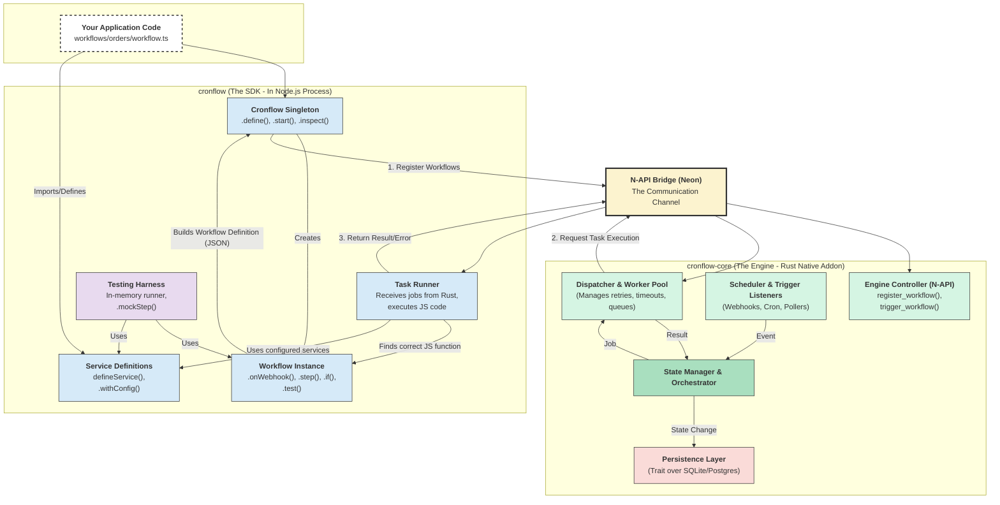

# Cronflow Final Architecture Design

## Overview

cronflow is a sophisticated workflow automation engine built on a **hybrid architecture** that combines the developer-friendly experience of Node.js with the rock-solid reliability and performance of Rust. This document provides the complete architectural reference for the entire system.

## Core Philosophy

The architecture follows a clear separation of concerns:

- **Node.js (The SDK)**: Handles the **Developer Experience (DX)**. It's the friendly, flexible, and dynamic "frontend" for the developer.
- **Rust (The Core Engine)**: Handles **Reliability and Performance**. It's the powerful, durable, and stateful "backend" that does the heavy lifting.

## High-Level Architecture

### Architectural Diagram



## Division of Responsibilities

The architecture leverages each language's strengths through a clear division of responsibilities:

| Responsibility / Domain            | Node.js (The SDK)                                                                                                                                                                                                                      | Rust (The Core Engine)                                                                                                                                                                                                                                 |
| ---------------------------------- | -------------------------------------------------------------------------------------------------------------------------------------------------------------------------------------------------------------------------------------- | ------------------------------------------------------------------------------------------------------------------------------------------------------------------------------------------------------------------------------------------------------ |
| **Workflow Definition**            | **PRIMARY**. Provides the entire fluent API: `cronflow.define()`, `.step()`, `.if()`, `.retry()`, etc. Its job is to build a declarative JSON representation (WDO) of the workflow.                                                    | **SECONDARY**. Receives the final JSON WDO. Its only job is to parse this JSON into its internal Rust structs for storage and execution. It has no knowledge of how the JSON was built.                                                                |
| **State Management & Persistence** | **STATELESS**. It holds no state between steps. It receives a `ctx` object for each job, uses it, and then forgets it.                                                                                                                 | **PRIMARY**. The "brain" of the system. Manages the state of every workflow and step (`RUNNING`, `FAILED`, etc.). It owns the database connection and is responsible for all CRUD operations on the internal SQLite/Postgres database.                 |
| **Scheduling & Triggers**          | **DEFINITION**. Defines what the trigger is (`.onSchedule(...)`, `.onWebhook(...)`). This information is serialized into the WDO.                                                                                                      | **IMPLEMENTATION**. Runs the actual cron scheduler. Runs the actual web server to listen for webhooks. Manages the stateful logic for polling. It is the active "listener" for all events.                                                             |
| **Task Execution**                 | **PRIMARY**. This is where the user's business logic runs. The "Task Runner" module receives a job from Rust, finds the correct JavaScript function `(ctx) => ...`, and executes it (e.g., fetch calls, db queries).                   | **SECONDARY**. Acts as a "Dispatcher." It tells the Node.js Task Runner which step to execute and then waits for a result. It treats the Node.js side as a "function execution service."                                                               |
| **Integrations & Services**        | **PRIMARY**. `defineService` and `.withConfig` are pure Node.js concepts. All the logic for talking to external APIs (Stripe, Slack, etc.) is written in TypeScript and lives here.                                                    | **SECONDARY**. Knows nothing about specific services like Slack or JIRA. It only provides the generic, low-level primitives that integrations can use (e.g., `engine.storage`, `engine.createWebhookTrigger`).                                         |
| **Error Handling & Retry Logic**   | **PRODUCES ERRORS**. When a user's step throws an exception, the Node.js Task Runner catches it and passes the serialized error back to Rust.                                                                                          | **MANAGES RETRIES**. Receives the error from Node.js. It then reads the step's retry configuration, manages the backoff delay, updates the attempt count in the database, and decides whether to re-dispatch the job or mark it as permanently failed. |
| **Concurrency & Performance**      | **SECONDARY**. The Node.js event loop handles I/O concurrency for the tasks it is told to run.                                                                                                                                         | **PRIMARY**. The tokio multi-threaded runtime manages the engine's worker pool for high-throughput job dispatching. It's responsible for connection pooling (DB, HTTP) and keeping overall CPU/memory usage low.                                       |
| **Testing**                        | **PRIMARY**. Provides the entire `.test()` harness (`.mockStep`, `.expectAction`, etc.). It includes an in-memory workflow runner that simulates the Rust engine's behavior to enable fast, easy testing without any Rust interaction. | **NOT INVOLVED** in the user-facing testing API. The Rust core's correctness is verified by its own separate suite of Rust unit and integration tests (`cargo test`).                                                                                  |
| **Configuration & Lifecycle**      | **PRIMARY**. Provides the user-facing API to start and stop the system (`cronflow.start()`, `cronflow.stop()`). It's also where the user provides `.env` or other configuration.                                                       | **IMPLEMENTATION**. Implements the actual lifecycle. It receives the start command and boots up all its internal components (scheduler, web server, DB pool). On stop, it gracefully shuts them down.                                                  |
| **Logging**                        | **SECONDARY**. The user's code can `console.log` within a step. The SDK can also provide a structured logger on the `ctx` object.                                                                                                      | **PRIMARY**. The engine performs its own structured logging for all core events (e.g., "Run Started", "Dispatching Job", "State Updated", "Engine Shutdown"). This provides a complete audit trail of the engine's internal operations.                |

## Component Breakdown

### 1. Node.js SDK Layer

The public-facing package that provides the developer experience.

#### **Cronflow Singleton**

- **Entry Point**: `import { cronflow } from 'cronflow'`
- **Responsibilities**:
  - Maintains registry of all defined Workflow instances
  - Provides `.define()`, `.start()`, `.trigger()`, `.inspect()` methods
  - Serializes workflow definitions to JSON for Rust engine
  - Manages engine state (`STOPPED`, `STARTING`, `STARTED`)

#### **Workflow Instance**

- **Creation**: Object created by `cronflow.define()`
- **Responsibilities**:
  - Builder pattern for workflow definition
  - Builds **Workflow Definition Object (WDO)** in memory
  - Provides fluent API: `.onWebhook()`, `.step()`, `.if()`, `.parallel()`
  - Serializable JSON representation of entire workflow

#### **Service Definitions**

- **Purpose**: Factory functions for creating integrations
- **Responsibilities**:
  - `defineService()` for creating service templates
  - `.withConfig()` for configuring service instances
  - Type-safe service actions and triggers
  - Integration with external APIs (Stripe, Slack, etc.)

#### **Task Runner**

- **Role**: Internal callback target for Rust engine
- **Responsibilities**:
  - Receives job requests via N-API bridge
  - Re-hydrates context object (`ctx.payload`, `ctx.steps`, `ctx.services`)
  - Executes user-defined JavaScript functions
  - Returns results or errors to Rust engine

#### **Testing Harness**

- **Purpose**: In-memory workflow execution for testing
- **Responsibilities**:
  - Bypasses Rust engine for fast testing
  - Provides `.mockStep()`, `.expectAction()` methods
  - Enables unit and integration testing without external dependencies

### 2. Rust Engine Layer

The high-performance core that handles orchestration and reliability.

#### **Engine Controller (N-API)**

- **Role**: Public-facing Rust module exposed to Node.js
- **Responsibilities**:
  - Provides N-API interface for Node.js communication
  - Handles workflow registration and triggering
  - Manages serialization/deserialization of data

#### **State Manager & Orchestrator**

- **Role**: The "brain" of the system
- **Responsibilities**:
  - Maintains state of every workflow run (`PENDING`, `RUNNING`, `SUCCESS`, `FAILED`)
  - Reads workflow JSON graphs from database
  - Determines next steps based on current state and graph
  - Understands control flow logic (`.if`, `.parallel`, `.batch`)
  - Creates jobs and sends them to Dispatcher

#### **Scheduler & Trigger Listeners**

- **Responsibilities**:
  - Manages time-based events (`onSchedule`, `onInterval`)
  - Runs high-performance web server for webhooks (`onWebhook`)
  - Handles polling triggers with stateful logic
  - Manages event buffering for complex triggers
  - Notifies State Manager when trigger conditions are met

#### **Dispatcher & Worker Pool**

- **Role**: The "hands" of the engine
- **Responsibilities**:
  - Receives jobs from State Manager
  - Manages concurrent worker pool for job processing
  - Handles retry, timeout, and delay logic
  - Makes calls to Node.js Task Runner via N-API
  - Reports task results back to State Manager

#### **Persistence Layer**

- **Implementation**: Abstraction over database connection
- **Default**: `rusqlite` for zero-config setup
- **Responsibilities**:
  - Stores workflow definitions and run history
  - Manages step results and logs
  - Handles engine primitives (idempotency keys, rate limits)
  - Supports pluggable backends (SQLite, Postgres)

## Communication Protocol

### N-API Bridge Design

The communication between Node.js and Rust happens through a well-defined protocol:

#### **Workflow Registration**

1. Node.js serializes workflow definitions to JSON
2. JSON sent to Rust via N-API
3. Rust parses JSON into internal structs
4. Workflow stored in database

#### **Job Execution**

1. Rust determines next step to execute
2. Job request sent to Node.js via N-API
3. Node.js Task Runner executes user function
4. Result/error returned to Rust
5. Rust updates state and determines next action

#### **Data Flow**

- **Node.js → Rust**: Workflow definitions, job results, errors
- **Rust → Node.js**: Job requests, context data, state updates

## State Management

### Workflow State Machine

The engine maintains a sophisticated state machine for each workflow run:

```rust
enum RunState {
    Pending { run_id: RunId, workflow: WorkflowDefinition, payload: Value },
    Running { run_id: RunId, current_step: String, completed_steps: HashMap<String, Value> },
    Completed { run_id: RunId, result: Value },
    Failed { run_id: RunId, error: String },
}
```

### Context Object

Each step receives a context object with:

- **`ctx.payload`**: Data from the trigger that started the workflow
- **`ctx.steps`**: Outputs from all previously completed steps
- **`ctx.services`**: Configured service instances for the workflow
- **`ctx.run`**: Metadata about the current run (`runId`, `workflowId`)
- **`ctx.state`**: Persistent state shared across workflow runs

## Key Architectural Benefits

### **Clear Separation of Concerns**

- **Node.js**: Handles the "what" (DX, defining workflows, integrations)
- **Rust**: Handles the "how" (scheduling, state, reliability)
- Makes the system easier to develop, test, and maintain

### **Performance and Reliability**

- **Rust**: Handles stateful, complex, performance-critical orchestration
- **Node.js**: Handles flexible, I/O-heavy, application-specific logic
- Leverages the world's largest ecosystem of libraries

### **Superior Developer Experience**

- Designed from the ground up to support elegant APIs
- Includes dependency injection for services (`ctx.services`)
- Fully integrated testing harness
- Type-safe throughout with TypeScript

### **Scalability**

- Worker pool in the Rust engine
- Pluggable persistence layer
- Scales from single process on laptop to multi-worker deployment
- Supports production Postgres database

## Development Phases

### **Phase 1: Core Foundation**

- Basic workflow definition and builder pattern
- Minimal Rust engine with N-API bridge
- Simple communication protocol
- SQLite persistence layer

### **Phase 2: Advanced Features**

- State management and persistence
- Trigger system (webhooks, schedules, events)
- Service integration framework
- Error handling and retry logic

### **Phase 3: Production Features**

- Testing harness and mocking
- Advanced control flow (parallel, race, forEach, batch)
- Human-in-the-loop capabilities
- Monitoring and observability

## Summary

This architecture provides the best of both worlds:

- **Node.js** for the developer-friendly experience, rich ecosystem, and flexible business logic
- **Rust** for the rock-solid reliability, high performance, and durable state management

The clear division of responsibilities ensures that each language handles what it does best, while the N-API bridge provides clean, efficient communication between the two layers. This design enables developers to build complex, reliable workflows with the simplicity and power they need.
